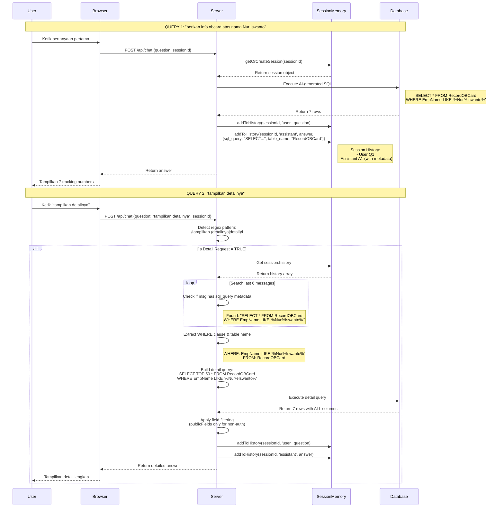
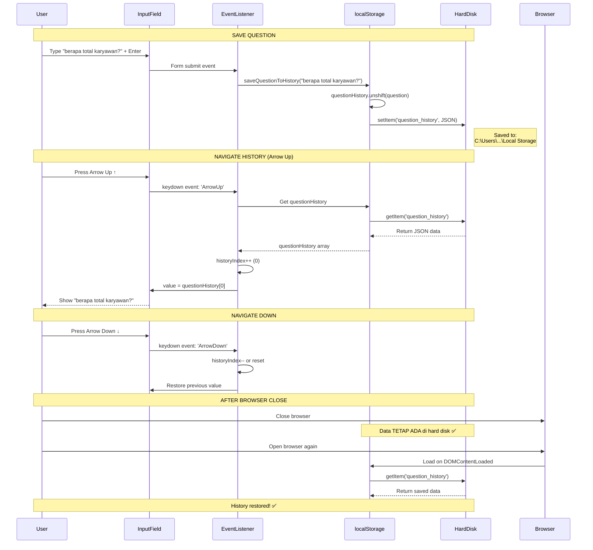

# 📚 Dokumentasi: Conversation Flow & Context Mechanism

## 📋 Daftar Isi

1. [Overview](#overview)
2. [Perbandingan Dua Mekanisme](#perbandingan-dua-mekanisme)
3. [Follow-up Question Mechanism (Server-Side)](#follow-up-question-mechanism-server-side)
4. [Arrow Up/Down History (Client-Side)](#arrow-updown-history-client-side)
5. [Flow Diagrams](#flow-diagrams)
6. [Code Implementation](#code-implementation)
7. [Testing](#testing)
8. [FAQ](#faq)

---

## Overview

Sistem chatbot ini memiliki **DUA MEKANISME BERBEDA** untuk mengelola percakapan:

1. **Follow-up Question Detection** - Context-aware follow-up menggunakan session memory di server
2. **Arrow Up/Down Navigation** - Input history navigation menggunakan localStorage di browser

**Kedua mekanisme ini TIDAK saling terkait dan bekerja secara independen.**

---

## Perbandingan Dua Mekanisme

| Aspek | Follow-up Question | Arrow Up/Down History |
|-------|-------------------|----------------------|
| **Lokasi** | 🖥️ Server (Node.js) | 💻 Browser (localStorage) |
| **File** | `app.js:33` | `index.html:674` |
| **Storage Type** | In-Memory Map | Browser localStorage API |
| **Persistence** | ❌ Hilang saat server restart | ✅ TIDAK hilang saat browser ditutup |
| **Limit** | 20 messages | 50 questions |
| **Data Tersimpan** | Message + sql_query metadata | Hanya teks pertanyaan |
| **Scope** | Per sessionId | Per browser/device |
| **Fungsi** | Context-aware follow-up | Input history navigation |
| **Storage Location** | RAM (Server Memory) | Hard Disk (Browser Storage) |

### Kapan Hilang?

**Follow-up Question Session:**
- ❌ Server restart
- ❌ Server crash
- ❌ Deployment baru
- ✅ Browser ditutup (tidak hilang, data di server)

**Arrow Up History:**
- ❌ Clear browser data
- ❌ Clear cookies/cache
- ❌ localStorage.clear()
- ✅ Browser ditutup (tidak hilang, data di disk)
- ✅ Tab ditutup (tidak hilang, data di disk)
- ✅ Computer restart (tidak hilang, data di disk)

---

## Follow-up Question Mechanism (Server-Side)

### 🎯 Tujuan

Memungkinkan user bertanya follow-up question seperti:
- User: "Berapa obcard atas nama Nur Iswanto?"
- Bot: "Ada 7 observation card..."
- User: **"tampilkan detailnya"** ← AI mengerti konteks sebelumnya!

### 🔧 Implementasi

#### 1. Session Storage (app.js:33)

```javascript
// In-memory storage - Hilang saat server restart
const sessions = new Map();

// Session structure
{
  'test_session_001': {
    id: 'test_session_001',
    history: [
      { role: 'user', content: 'Q1', timestamp: Date },
      {
        role: 'assistant',
        content: 'A1',
        sql_query: 'SELECT * FROM RecordOBCard WHERE...',  // 🔑 KEY METADATA
        table_name: 'RecordOBCard'
      },
      { role: 'user', content: 'Q2', timestamp: Date }
    ],
    authState: 'none',
    debugMode: false,
    userName: null
  }
}
```

#### 2. Save Message with Metadata (app.js:51-65)

```javascript
function addToHistory(sessionId, role, content, metadata = {}) {
  const session = getOrCreateSession(sessionId);
  session.history.push({
    role,           // 'user' atau 'assistant'
    content,        // Pertanyaan atau jawaban
    timestamp: new Date(),
    ...metadata     // 🔑 sql_query, table_name
  });

  // Keep only last 20 messages
  if (session.history.length > 20) {
    session.history = session.history.slice(-20);
  }
}
```

#### 3. Follow-up Detection (app.js:517-590)

```javascript
// Regex pattern untuk detect follow-up request
const isDetailRequest = /^(siapa saja|tampilkan (daftarnya|namanya|semua|semuanya|detailnya|detail)|show (me )?(the )?(list|names|all|details?)|who are they)\??$/i.test(userMessage.trim());

if (isDetailRequest && session.history.length >= 2) {
  console.log("🔄 Detected detail request - extracting context");

  // Loop through last 6 messages mencari SQL query
  for (let i = session.history.length - 1; i >= Math.max(0, session.history.length - 6); i--) {
    const msg = session.history[i];

    if (msg.sql_query) {  // 🔑 Cari message dengan SQL metadata
      // Extract WHERE clause dan table name
      const whereMatch = previousSQL.match(/WHERE\s+(.*?)(?:ORDER BY|GROUP BY|$)/i);
      const tableMatch = previousSQL.match(/FROM\s+(\w+)/i);

      // Build query baru dengan konteks yang sama
      const detailQuery = `SELECT TOP 50 * FROM ${fromTable} WHERE ${whereClause}`;

      // Execute query dan return detailed data
      const detailResults = await queryDB(detailQuery);
      // ... apply field filtering ...
    }
  }
}
```

#### 4. Supported Follow-up Patterns

**Bahasa Indonesia:**
- `siapa saja`
- `tampilkan daftarnya`
- `tampilkan namanya`
- `tampilkan semua`
- `tampilkan semuanya`
- `tampilkan detailnya` ✨
- `tampilkan detail` ✨

**English:**
- `show me the list`
- `show the names`
- `show all`
- `show details`
- `show me the details`
- `who are they`

### 📊 Data Flow

```
User Query 1: "info obcard Nur Iswanto"
    ↓
Server: Generate SQL → Execute → Return results
    ↓
Server: addToHistory(sessionId, 'assistant', answer, {
    sql_query: "SELECT * FROM RecordOBCard WHERE EmpName LIKE '%Nur%Iswanto%'",
    table_name: "RecordOBCard"
})
    ↓
sessions.get('test_session_001').history = [
    { role: 'user', content: 'info obcard...' },
    { role: 'assistant', content: 'Ada 7...', sql_query: 'SELECT...', table_name: 'RecordOBCard' }
]
    ↓
    ↓
User Query 2: "tampilkan detailnya"
    ↓
Server: Detect follow-up pattern ✅
    ↓
Server: Loop last 6 messages → Find sql_query metadata
    ↓
Server: Extract WHERE + FROM → Build new query
    ↓
Server: SELECT TOP 50 * FROM RecordOBCard WHERE EmpName LIKE '%Nur%Iswanto%'
    ↓
Server: Return detailed results 🎉
```

### 🔒 Field Filtering

Data yang dikembalikan akan difilter berdasarkan authentication status:

**Non-Authenticated User (publicFields only):**
```javascript
// tableMapping.js:67-75
publicFields: [
  'TrackingNum',      // ID/Nomor tracking
  'EmpName',          // Nama pembuat
  'Problem',          // Masalah yang ditemukan
  'BeforeAction',     // Tindakan sebelum observasi
  'Year',             // Tahun
  'Month',            // Bulan
  'last_synced_at'    // Terakhir sinkronisasi
]
```

**Authenticated User (ALL fields):**
```javascript
// All fields including:
restrictedFields: [
  'EmpID',            // Employee ID (sensitif)
  'ImageFinding',     // Path/URL gambar (sensitif)
  'CompanyID',        // Company ID
  // ... all other fields
]
```

---

## Arrow Up/Down History (Client-Side)

### 🎯 Tujuan

Memungkinkan user menavigasi history pertanyaan sebelumnya menggunakan Arrow Up/Down keys, seperti terminal command history.

### 🔧 Implementasi

#### 1. localStorage Storage (index.html:674)

```javascript
// Permanent storage di browser - TIDAK hilang saat browser ditutup
let questionHistory = JSON.parse(
  localStorage.getItem('question_history') || '[]'
);
let historyIndex = -1;
let currentInput = '';

// Path storage (contoh di Chrome):
// C:\Users\[Username]\AppData\Local\Google\Chrome\User Data\Default\Local Storage
```

#### 2. Save Question to History (index.html:679-693)

```javascript
function saveQuestionToHistory(question) {
  // Add to beginning of array (LIFO - Last In First Out)
  questionHistory.unshift(question);

  // Keep only last 50 questions
  if (questionHistory.length > 50) {
    questionHistory = questionHistory.slice(0, 50);
  }

  // Save to browser localStorage (PERMANENT until cleared)
  localStorage.setItem('question_history', JSON.stringify(questionHistory));

  // Reset history index
  historyIndex = -1;
}
```

#### 3. Arrow Key Navigation (index.html:696-727)

```javascript
chatInput.addEventListener('keydown', (e) => {
  if (e.key === 'ArrowUp') {
    e.preventDefault();

    if (questionHistory.length === 0) return;

    // Save current input if we're at the beginning
    if (historyIndex === -1) {
      currentInput = chatInput.value;
    }

    // Navigate up in history (older questions)
    if (historyIndex < questionHistory.length - 1) {
      historyIndex++;
      chatInput.value = questionHistory[historyIndex];
    }
  }
  else if (e.key === 'ArrowDown') {
    e.preventDefault();

    if (historyIndex === -1) return;

    // Navigate down in history (newer questions)
    if (historyIndex > 0) {
      historyIndex--;
      chatInput.value = questionHistory[historyIndex];
    } else {
      // Back to current input
      historyIndex = -1;
      chatInput.value = currentInput;
    }
  }
});
```

#### 4. Call on Submit (index.html:91)

```javascript
chatForm.addEventListener('submit', async (e) => {
  e.preventDefault();
  const userMessage = chatInput.value.trim();
  if (!userMessage || isTyping) return;

  // Save to history (called BEFORE sending to server)
  saveQuestionToHistory(userMessage);

  // ... rest of submit logic ...
});
```

### 📊 Data Flow

```
User: Type "berapa total karyawan?" → Enter
    ↓
JavaScript: saveQuestionToHistory("berapa total karyawan?")
    ↓
questionHistory = ["berapa total karyawan?", "previous Q1", "previous Q2", ...]
    ↓
localStorage.setItem('question_history', JSON.stringify(questionHistory))
    ↓
💾 Saved to Hard Disk (PERMANENT)
    ↓
    ↓
User: Press Arrow Up ↑
    ↓
JavaScript: historyIndex++ (from -1 to 0)
    ↓
chatInput.value = questionHistory[0]  // "berapa total karyawan?"
    ↓
Input field populated with previous question ✅
    ↓
    ↓
User: Press Arrow Up ↑ again
    ↓
JavaScript: historyIndex++ (from 0 to 1)
    ↓
chatInput.value = questionHistory[1]  // "previous Q1"
    ↓
    ↓
User: Press Arrow Down ↓
    ↓
JavaScript: historyIndex-- (from 1 to 0)
    ↓
chatInput.value = questionHistory[0]  // Back to "berapa total karyawan?"
```

### 📋 localStorage Format

```json
{
  "question_history": [
    "tampilkan detailnya",
    "berikan info obcard atas nama Nur Iswanto",
    "berapa total karyawan cladtek?",
    "apa itu AI?",
    "jelaskan machine learning",
    "..."
  ]
}
```

### 🔍 Inspect localStorage

**Chrome DevTools:**
1. F12 → Application Tab
2. Storage → Local Storage
3. http://localhost:3000
4. Key: `question_history`

---

## Flow Diagrams

### Follow-up Question Detection Flow



### Arrow Up/Down Navigation Flow



---

## Code Implementation

### Server-Side: Session Management (app.js)

```javascript
// ============================================
// SESSION STORAGE & MANAGEMENT
// ============================================

// In-memory storage untuk conversation history
const sessions = new Map();

/**
 * Get or create session by sessionId
 * @param {string} sessionId - Unique session identifier
 * @returns {Object} Session object
 */
function getOrCreateSession(sessionId) {
  if (!sessions.has(sessionId)) {
    sessions.set(sessionId, {
      id: sessionId,
      history: [],                    // Conversation history
      createdAt: new Date(),
      lastActivity: new Date(),
      authState: 'none',              // 'none', 'pending_password', 'authenticated'
      debugMode: false,
      userName: null
    });
  }
  return sessions.get(sessionId);
}

/**
 * Add message to session history with optional metadata
 * @param {string} sessionId - Session identifier
 * @param {string} role - 'user' or 'assistant'
 * @param {string} content - Message content
 * @param {Object} metadata - Optional metadata (sql_query, table_name, etc)
 */
function addToHistory(sessionId, role, content, metadata = {}) {
  const session = getOrCreateSession(sessionId);
  session.history.push({
    role,
    content,
    timestamp: new Date(),
    ...metadata  // 🔑 sql_query, table_name
  });
  session.lastActivity = new Date();

  // Keep only last 20 messages untuk efisiensi
  if (session.history.length > 20) {
    session.history = session.history.slice(-20);
  }
}

/**
 * Get conversation context from session
 * @param {string} sessionId - Session identifier
 * @param {number} limit - Number of recent conversation pairs
 * @returns {string} Formatted conversation context
 */
function getConversationContext(sessionId, limit = 5) {
  const session = sessions.get(sessionId);
  if (!session || session.history.length === 0) {
    return '';
  }

  const recentHistory = session.history.slice(-limit * 2);
  return recentHistory.map(msg => {
    return `${msg.role === 'user' ? 'User' : 'Assistant'}: ${msg.content}`;
  }).join('\n');
}
```

### Server-Side: Follow-up Detection (app.js)

```javascript
// ============================================
// FOLLOW-UP QUESTION DETECTION
// ============================================

/**
 * Detect and process follow-up questions
 * Patterns: "tampilkan detailnya", "siapa saja", "show details", etc.
 */
async function detectAndProcessFollowUp(userMessage, session) {
  // Regex pattern untuk detect follow-up request
  const isDetailRequest = /^(siapa saja|tampilkan (daftarnya|namanya|semua|semuanya|detailnya|detail)|show (me )?(the )?(list|names|all|details?)|who are they)\??$/i.test(userMessage.trim());

  if (isDetailRequest && session.history.length >= 2) {
    console.log("🔄 Detected detail request - extracting context from previous query");

    // Look for previous SQL query in history (last 6 messages)
    for (let i = session.history.length - 1; i >= Math.max(0, session.history.length - 6); i--) {
      const msg = session.history[i];

      if (msg.sql_query) {
        const previousSQL = msg.sql_query;
        console.log("📝 Found previous SQL:", previousSQL);

        // Extract WHERE clause from previous query
        const whereMatch = previousSQL.match(/WHERE\s+(.*?)(?:ORDER BY|GROUP BY|$)/i);
        const tableMatch = previousSQL.match(/FROM\s+(\w+)/i);

        if (whereMatch && tableMatch) {
          const whereClause = whereMatch[1].trim();
          const fromTable = tableMatch[1];

          // Generate new query to get detail data
          const detailQuery = `SELECT TOP 50 * FROM ${fromTable} WHERE ${whereClause}`;
          console.log("🔄 Re-querying with details:", detailQuery);

          try {
            const detailResults = await queryDB(detailQuery);

            if (detailResults && detailResults.length > 0) {
              // Get mapping info for this table
              const tableMapping = TABLE_MAPPINGS.find(m => m.tableName === fromTable);

              // Apply field filtering based on authentication status
              const isAuthenticated = session.authState === 'authenticated' && session.debugMode;
              const filteredData = tableMapping
                ? filterFieldsByAuth(tableMapping, detailResults, isAuthenticated)
                : detailResults;

              console.log(`🔒 Field filtering applied - Authenticated: ${isAuthenticated}`);

              return {
                type: 'ai_generated_query',
                data: filteredData,
                description: `Detail data from previous query`,
                sql_query: detailQuery,
                query_method: 'Follow-up Detail Query',
                table_name: fromTable
              };
            }
          } catch (err) {
            console.log("⚠️ Detail query failed:", err.message);
          }

          break;
        }
      }
    }
  }

  return null;
}
```

### Client-Side: localStorage History (index.html)

```javascript
// ============================================
// QUESTION HISTORY - LOCAL STORAGE
// ============================================

// Load history from localStorage (persisted across sessions)
let questionHistory = JSON.parse(
  localStorage.getItem('question_history') || '[]'
);
let historyIndex = -1;
let currentInput = '';

/**
 * Save question to localStorage history
 * @param {string} question - User question to save
 */
function saveQuestionToHistory(question) {
  // Add to beginning of array (LIFO)
  questionHistory.unshift(question);

  // Keep only last 50 questions
  if (questionHistory.length > 50) {
    questionHistory = questionHistory.slice(0, 50);
  }

  // Save to localStorage (PERMANENT)
  localStorage.setItem('question_history', JSON.stringify(questionHistory));

  // Reset history index
  historyIndex = -1;
}

/**
 * Arrow key navigation for question history
 */
chatInput.addEventListener('keydown', (e) => {
  if (e.key === 'ArrowUp') {
    e.preventDefault();

    if (questionHistory.length === 0) return;

    // Save current input if we're at the beginning
    if (historyIndex === -1) {
      currentInput = chatInput.value;
    }

    // Navigate up in history (older questions)
    if (historyIndex < questionHistory.length - 1) {
      historyIndex++;
      chatInput.value = questionHistory[historyIndex];
    }
  }
  else if (e.key === 'ArrowDown') {
    e.preventDefault();

    if (historyIndex === -1) return;

    // Navigate down in history (newer questions)
    if (historyIndex > 0) {
      historyIndex--;
      chatInput.value = questionHistory[historyIndex];
    } else {
      // Back to current input
      historyIndex = -1;
      chatInput.value = currentInput;
    }
  }
});

/**
 * Call saveQuestionToHistory on form submit
 */
chatForm.addEventListener('submit', async (e) => {
  e.preventDefault();
  const userMessage = chatInput.value.trim();
  if (!userMessage || isTyping) return;

  // Save to localStorage history
  saveQuestionToHistory(userMessage);

  // ... rest of submit logic ...
});
```

---

## Testing

### Test Follow-up Question Feature

```bash
# Terminal 1: Start server
npm start

# Terminal 2: Test follow-up flow
curl -s -X POST http://localhost:3000/api/chat \
  -H "Content-Type: application/json" \
  -d '{
    "question":"berikan saya informasi tentang observation card atas nama Nur Iswanto",
    "sessionId":"test_session_001",
    "mode":"internal"
  }'

# Wait 2 seconds, then send follow-up
sleep 2

curl -s -X POST http://localhost:3000/api/chat \
  -H "Content-Type: application/json" \
  -d '{
    "question":"tampilkan detailnya",
    "sessionId":"test_session_001",
    "mode":"internal"
  }'
```

**Expected Result:**
- First query returns: List of tracking numbers
- Second query returns: **Detailed information** for all 7 observation cards

### Test localStorage History

1. Open browser: http://localhost:3000
2. Type: "berapa total karyawan?" + Enter
3. Type: "apa itu AI?" + Enter
4. Press **Arrow Up** ↑
   - Expected: Input shows "apa itu AI?"
5. Press **Arrow Up** ↑ again
   - Expected: Input shows "berapa total karyawan?"
6. Close browser
7. Reopen browser
8. Press **Arrow Up** ↑
   - Expected: History still available! ✅

### Check localStorage Data

**Chrome DevTools:**
```javascript
// Open Console (F12)
localStorage.getItem('question_history')

// Output:
// '["apa itu AI?","berapa total karyawan?"]'
```

---

## FAQ

### Q: Mengapa follow-up session hilang saat server restart?

**A:** Karena session disimpan di **in-memory Map** (RAM), bukan di database atau file. Solusi untuk production:

```javascript
// Option 1: Redis
const Redis = require('ioredis');
const redis = new Redis();

async function getOrCreateSession(sessionId) {
  let session = await redis.get(`session:${sessionId}`);
  if (!session) {
    session = { id: sessionId, history: [], ... };
    await redis.setex(`session:${sessionId}`, 3600, JSON.stringify(session));
  }
  return JSON.parse(session);
}

// Option 2: Database
// Store sessions in PostgreSQL/MongoDB with TTL
```

### Q: Mengapa localStorage tidak hilang saat browser ditutup?

**A:** localStorage adalah **persistent storage** yang disimpan di hard disk, bukan di RAM. Berbeda dengan sessionStorage yang hilang saat tab ditutup.

```javascript
// localStorage = Hard disk (PERMANENT)
localStorage.setItem('key', 'value');  // ✅ Tetap ada setelah browser ditutup

// sessionStorage = Memory per tab (TEMPORARY)
sessionStorage.setItem('key', 'value');  // ❌ Hilang saat tab ditutup
```

### Q: Bagaimana cara membersihkan session memory di server?

**A:** Implementasi auto-cleanup:

```javascript
// Auto cleanup inactive sessions (every 1 hour)
setInterval(() => {
  const now = new Date();
  for (const [sessionId, session] of sessions.entries()) {
    const inactive = (now - session.lastActivity) / 1000 / 60 / 60;  // hours
    if (inactive > 24) {  // 24 hours inactive
      console.log(`🗑️ Cleaning up inactive session: ${sessionId}`);
      sessions.delete(sessionId);
    }
  }
}, 60 * 60 * 1000);  // Every 1 hour
```

### Q: Bagaimana menambahkan follow-up pattern baru?

**A:** Edit regex pattern di `app.js:517`:

```javascript
// OLD
const isDetailRequest = /^(siapa saja|tampilkan (daftarnya|detailnya))/i.test(...);

// NEW - Tambahkan pattern baru
const isDetailRequest = /^(siapa saja|tampilkan (daftarnya|detailnya)|lebih lengkap|info lengkap)/i.test(...);
```

### Q: Bagaimana cara limit localStorage size?

**A:** localStorage punya limit 5-10MB per domain. Untuk kontrol manual:

```javascript
function saveQuestionToHistory(question) {
  questionHistory.unshift(question);

  // Custom limit based on total size
  const totalSize = new Blob([JSON.stringify(questionHistory)]).size;
  while (totalSize > 1024 * 1024 && questionHistory.length > 10) {  // Max 1MB
    questionHistory.pop();  // Remove oldest
  }

  localStorage.setItem('question_history', JSON.stringify(questionHistory));
}
```

### Q: Apa perbedaan publicFields vs restrictedFields?

**A:** Field filtering untuk keamanan data:

```javascript
// tableMapping.js
publicFields: [
  'TrackingNum',   // ✅ Visible for all users
  'EmpName',       // ✅ Visible for all users
  'Problem'        // ✅ Visible for all users
],

restrictedFields: [
  'EmpID',         // ❌ Only visible in Debug Mode
  'ImageFinding',  // ❌ Only visible in Debug Mode
  'CompanyID'      // ❌ Only visible in Debug Mode
]
```

Non-authenticated users hanya melihat `publicFields`. Authenticated users (debug mode) melihat **ALL fields**.

---

## 📝 Changelog

### v1.1.0 (2025-10-11)

**✨ Features:**
- ✅ Implemented follow-up question detection
- ✅ Added regex patterns for Indonesian & English
- ✅ Session-based context memory
- ✅ Field filtering for security
- ✅ localStorage-based arrow up/down navigation

**🐛 Bug Fixes:**
- ✅ Fixed `ORDER BY name` error → Removed hardcoded ORDER BY
- ✅ Fixed publicFields mismatch → Updated to actual table columns

**📚 Documentation:**
- ✅ Complete flow diagrams (Mermaid.js)
- ✅ Code examples and testing guide
- ✅ FAQ section

---

## 🔗 Related Files

- `app.js` - Server-side session management & follow-up detection
- `index.html` - Client-side localStorage & arrow key navigation
- `tableMapping.js` - Field filtering configuration
- `db.js` - Database query execution
- `prompts.js` - AI prompt generation

---

**Last Updated:** 11 Oktober 2025
**Version:** 1.1.0
**Author:** Claude AI Assistant
**Project:** Cladtek AI Chatbot
